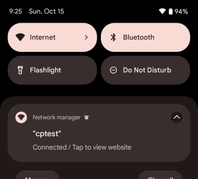
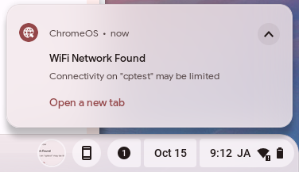
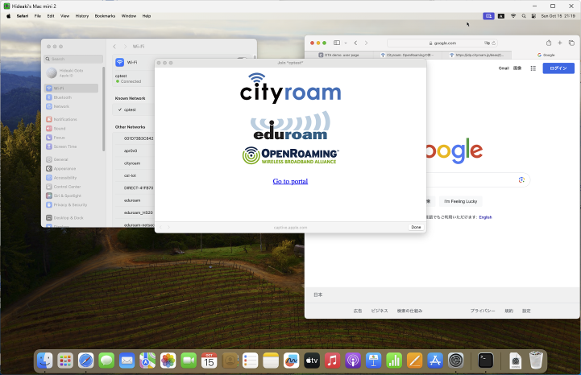

# VenueInfoHandler
API/CGI for Venue Information notification on Public Wi-Fi to help users reach out to the portal site at the venue.

**This software is specialized for Venue Information notification rather than Captive Portal that blocks the network usage.** No access control is supported. The main purpose is to improve user engagement while allowing people to use the network continuously.

When Captive Portal with access control is needed,
these links would be useful.
- [openNDS](https://github.com/openNDS/openNDS)
- [CoovaChilli](https://coova.github.io/CoovaChilli/)

## Supported platforms

Please see also [Capport support status](OS-status.md).

### Modern Capport (RFC 8908/8910/8952)
- Android 11+
- iOS/iPadOS 15+
- macOS 13 (Ventura)+

### Vendor-specific Captive Portal
- iOS/iPadOS 14 and some older ones
- macOS 12 (Montrerey) and some older ones
- Windows 10/11
- ChromeOS

## Specifications
- Capport API (RFC 8908/8910) is the primary, while vendor-specific methods are optional.
- Usable with Open, PSK, 802.1X, and Passpoint networks.
- Support partly Apple's legacy Captive Portal mechanism (CNA, Captive Network Assistant).

## Requirements
- Redis
- Perl
- (Local) HTTP server with a server certificate issued by a popular CA
- Local DNS server
- DHCP server

## Limitations
- (Disturbing) Captive Portal is enforced on Apple OSs since they haven't got a nice notification mechanism.
- No support for Android 10 and older.
- Not working well over NAPT. To overcome this, we will need a DHCP server that can attach some paramters like MAC address in order for the API to uniquely identify the user device behind a NAPT box. There's no hope for the legacy methods.

## Website layout
- https://\<portal.example.net\>/ -- Portal site of the venue. (SSL is required)
- https://\<example.com\>/cp/ -- Capport API (SSL is required)
- http://\<local IP address\>/ -- Diverted destination for vendor-specific legacy captive portal mechanisms. (No SSL)

## Configuration
- Edit capport.cfg and index.cgi in cp/.
- Edit hotspot-detect.html
- Make sure all required modules exist. (Do perl -c api.cgi for example.)
- Setup Apache HTTP server or an alternative.
 Note that the system doesn't work over NAT because the CGI scripts have to rely on REMOTE_ADDR to discriminate each user device.
- Setup and run Redis server.
- Setup local DNS and DHCP servers. [Dnsmasq](http://www.thekelleys.org.uk/dnsmasq/doc.html) is a handy DNS/DHCP server for this purpose.
- To enable Captive Portal API (Capport API) for Android 11+ and Apple devices, add DHCP option 114 as follows. Access Network ID (anid) may be omitted.
  - [Dnsmasq] dhcp-option=114,https://example.com/cp/api.cgi?cp=0&anid=deadbeef
  - [ISC DHCP] option default-url "https://example.com/cp/api.cgi?cp=0&anid=deadbeef"
  - [RouterOS]  
/ip/dhcp-server/option/add code=114 name=venueinfo value="'https://example.com/cp/api.cgi?cp=0&anid=deadbeef'"  
/ip/dhcp-server/option/sets/add name=default options=venueinfo  
/ip/dhcp-server/set \<num\> dhcp-option-set=default
  

- To enable Splash Page on Android, set cp=1.
  - [Dnsmasq] dhcp-option=114,https://example.com/cp/api.cgi?cp=1
  - [ISC DHCP] option default-url "https://example.com/cp/api.cgi?cp=1"
- To support Google's legacy mechanism for ChromeOS, etc., override some host names as follows.
  - [Dnsmasq]  
address=/www.gstatic.com/\<local HTTP server address\>  
address=/connectivitycheck.gstatic.com/\<local HTTP server address\>
  

- To support Apple's legacy mechanism for macOS and iOS/iPadOS, override a host name as follows.
  - [Dnsmasq]  
address=/\<local HTTP server FQDN\>/\<local HTTP server address\>  
cname=captive.apple.com,\<local HTTP server FQDN\>
  

- To support Microsoft-specific mechanism for Windows 10/11, override a host name as follows.
  - [Dnsmasq]  
address=/www.msftconnecttest.com/\<local HTTP server address\>  

- **In a nutshell,** see [example-dnsmasq.conf](example-dnsmasq.conf) .

## Passing the Access Network ID to the website (optional)
Only the Captive Portal API supports this feature.

The API passes transparently an optional parameter ``anid=\<string\>''
in the DHCP configuration to the splash/portal page.
This is useful for building a location-aware website.
Service providers may define their own ID string.
